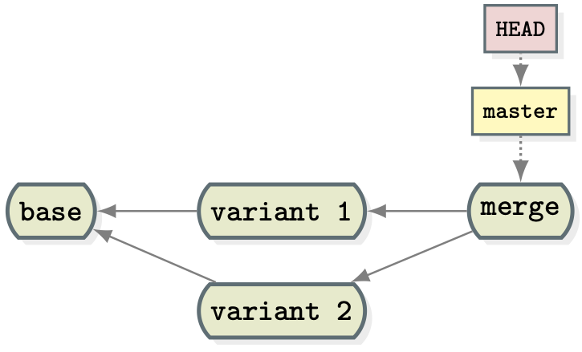

# UNSETTLE (aUtomatic uNit teSt gEneraTion for semanTic confLict dEtection)

UNSETTLE is a framework that automatically detects semantic conflicts in version
control systems (e.g., git) of Java programs.  It first identifies common causes
of semantic conflicts in merge commits and then generates unit test cases that
reveal the conflicts.

UNSETTLE is mainly composed by two modules:

1. [Changes-Matcher](https://github.com/conflito/changes-matcher) which is
responsible for identifying whether any common cause of semantic conflicts
(e.g., parallel modifications to the same method) has occurred in a given merge commit.
2. [Test Generator](https://github.com/conflito/evosuite/tree/trigger-semantic-conflict-with-latest-evosuiter-version)
which is responsible for generating a conflict-revealing test case.

Given the following merge scenario as an example:



[Changes-Matcher](https://github.com/conflito/changes-matcher) starts by
computing the differences between the base version of a merge commit and each
variant (i.e., branch).  Then, it compares these changes to a set of change
patterns that capture potential causes for semantic conflicts.  If the changes
correspond to an instance of a pattern,
[Changes-Matcher](https://github.com/conflito/changes-matcher) has successfully
identified a semantic conflict in the merge commit.

Once the conflict has been identified, the test generation phase takes place.
The [test generator](https://github.com/conflito/evosuite/tree/trigger-semantic-conflict-with-latest-evosuiter-version),
built on top of the [EvoSuite](https://github.com/EvoSuite/evosuite) tool, is
guided by the information about the changes between the base version and its
variants to find a test that is able to trigger the conflict.

Note: For convenience, the [`tools/get-tools.sh`](`tools/get-tools.sh`) script
automatically downloads and builds UNSETTLE's modules.

## Using UNSETTLE

In a common merge scenario, as the one in the figure above, four versions of the
program under test are required to run UNSETTLE: the base version, variant 1 and
2 versions, and the merge version.  As described in the following table, for the
base version UNSETTLE only requires the source code, for the merge version it
only requires the compiled classes, and for both variants it requires the source
code and the compiled classes.

| Version   | Source code | Compiled classes |
|:----------|:------------|:----------------:|
| base      | YES         | NO               |
| variant 1 | YES         | YES              |
| variant 2 | YES         | YES              |
| merge     | NO          | YES              |

As a usage example, let us consider the project https://github.com/netty/netty
and its merge commit [193acdb36cd3da9bfc62dd69c4208dff3f0a2b1b](https://github.com/netty/netty/tree/193acdb36cd3da9bfc62dd69c4208dff3f0a2b1b).
In detail,

- Repository URL: [https://github.com/netty/netty.git](https://github.com/netty/netty.git)
- Merge commit: [193acdb36cd3da9bfc62dd69c4208dff3f0a2b1b](https://github.com/netty/netty/commit/193acdb36cd3da9bfc62dd69c4208dff3f0a2b1b)
- Variant 1 commit: [b3b096834cafc7f348583786d71567e9fa001b55](https://github.com/netty/netty/commit/b3b096834cafc7f348583786d71567e9fa001b55)
- Variant 2 commit: [c2417c253c48bac942decfe923743d2b09d63a5f](https://github.com/netty/netty/commit/c2417c253c48bac942decfe923743d2b09d63a5f)
- Base commit: [2fc18a00f6ac61a365b73dd498dd2e38f1efa823](https://github.com/netty/netty/commit/2fc18a00f6ac61a365b73dd498dd2e38f1efa823)

Note: the base commit can automatically be extracted from project's git
repository, e.g.,

```bash
git merge-base --octopus b3b096834cafc7f348583786d71567e9fa001b55 c2417c253c48bac942decfe923743d2b09d63a5f
```

### Setup

1. Clone project's repository

```bash
git clone --bare https://github.com/netty/netty.git netty-repository.git
```

2. Get base, variant 1, variant 2, and merge versions

```bash
# Base
git clone netty-repository.git base
(cd base; git checkout 2fc18a00f6ac61a365b73dd498dd2e38f1efa823)

# Variant 1
git clone netty-repository.git variant-1
(cd variant-1; git checkout b3b096834cafc7f348583786d71567e9fa001b55)

# Variant 2
git clone netty-repository.git variant-2
(cd variant-2; git checkout c2417c253c48bac942decfe923743d2b09d63a5f)

# Merge
git clone netty-repository.git merge
(cd merge; git checkout 193acdb36cd3da9bfc62dd69c4208dff3f0a2b1b)
```

3. Build variant 1, variant 2, and merge versions

```bash
# Variant 1
(cd variant-1; mvn clean compile -Dmaven.repo.local=$(pwd)/.m2)

# Variant 2
(cd variant-2; mvn clean compile -Dmaven.repo.local=$(pwd)/.m2)

# Merge
(cd merge; mvn clean compile -Dmaven.repo.local=$(pwd)/.m2)
```

4. Collect variant 1's, variant 2's, and merge's dependencies

```bash
# Variant 1
(cd variant-1; mvn dependency:copy-dependencies -Dmaven.repo.local=$(pwd)/.m2 -DoutputDirectory=$(pwd)/.deps)

# Variant 2
(cd variant-2; mvn dependency:copy-dependencies -Dmaven.repo.local=$(pwd)/.m2 -DoutputDirectory=$(pwd)/.deps)

# Merge
(cd merge; mvn dependency:copy-dependencies -Dmaven.repo.local=$(pwd)/.m2 -DoutputDirectory=$(pwd)/.deps)
```

5. Collect variant 1's, variant 2's, and merge's classpath

```bash
# Variant 1
variant_1_classpath=$(cd variant-1; echo $(pwd)/target/classes:$(find .deps -type f -name "*.jar" | sed "s|^|$(pwd)/|g" | tr '\n' ':'))

# Variant 2
variant_2_classpath=$(cd variant-2; echo $(pwd)/target/classes:$(find .deps -type f -name "*.jar" | sed "s|^|$(pwd)/|g" | tr '\n' ':'))

# Merge
merge_classpath=$(cd merge; echo $(pwd)/target/classes:$(find .deps -type f -name "*.jar" | sed "s|^|$(pwd)/|g" | tr '\n' ':'))
```

6. Collect the set of `.java` files involved in the merge commit

```bash
# Get set of files involved in the merge commit
modified_files=$(cd merge; git diff --name-only HEAD^1 src/main/java)

# Path to the files involved in the merge commit under base/
base_modified_files=$(echo "$modified_files" | sed "s|^|base/|g" | tr '\n' ';')

# Path to the files involved in the merge commit under variant-1/
variant_1_modified_files=$(echo "$modified_files" | sed "s|^|variant-1/|g" | tr '\n' ';')

# Path to the files involved in the merge commit under variant-2/
variant_2_modified_files=$(echo "$modified_files" | sed "s|^|variant-2/|g" | tr '\n' ';')
```

### Semantic Conflict Detection

[Changes-Matcher](https://github.com/conflito/changes-matcher) relies on a
configuration file that allows one for some customizable options.  For the
project example the configuration file (e.g., `netty-193acdb-configuration.txt`)
can be configured as

```
# Relative or absolute path to the source directory of the base version
base.src.dir=base/src/main/java

# Relative or absolute path to the source directory of the first variant version
var1.src.dir=variant-1/src/main/java

# Relative or absolute path to the source directory of the second variant version
var2.src.dir=variant-2/src/main/java

# Relative or absolute classpath of the first variant version
var1.cp.dir=variant-1/target/classes:variant-1/.deps/easymockclassextension-2.5.2.jar:variant-1/.deps/commons-logging-1.1.1.jar:variant-1/.deps/org.osgi.compendium-1.4.0.jar:variant-1/.deps/junit-4.10.jar:variant-1/.deps/slf4j-api-1.6.1.jar:variant-1/.deps/cglib-nodep-2.2.jar:variant-1/.deps/jmock-2.5.1.jar:variant-1/.deps/objenesis-1.2.jar:variant-1/.deps/protobuf-java-2.3.0.jar:variant-1/.deps/log4j-1.2.16.jar:variant-1/.deps/org.osgi.core-1.4.0.jar:variant-1/.deps/servlet-api-2.5.jar:variant-1/.deps/jboss-logging-spi-2.1.2.GA.jar:variant-1/.deps/hamcrest-library-1.1.jar:variant-1/.deps/slf4j-simple-1.6.1.jar:variant-1/.deps/hamcrest-core-1.1.jar:variant-1/.deps/easymock-2.5.2.jar:variant-1/.deps/jmock-junit4-2.5.1.jar:variant-1/.deps/rxtx-2.1.7.jar:variant-1/.deps/junit-dep-4.4.jar:

# Relative or absolute classpath of the second variant version
var2.cp.dir=variant-2/target/classes:variant-2/.deps/easymockclassextension-2.5.2.jar:variant-2/.deps/commons-logging-1.1.1.jar:variant-2/.deps/org.osgi.compendium-1.4.0.jar:variant-2/.deps/slf4j-api-1.6.1.jar:variant-2/.deps/cglib-nodep-2.2.jar:variant-2/.deps/jmock-2.5.1.jar:variant-2/.deps/objenesis-1.2.jar:variant-2/.deps/protobuf-java-2.3.0.jar:variant-2/.deps/log4j-1.2.16.jar:variant-2/.deps/org.osgi.core-1.4.0.jar:variant-2/.deps/servlet-api-2.5.jar:variant-2/.deps/jboss-logging-spi-2.1.2.GA.jar:variant-2/.deps/hamcrest-library-1.1.jar:variant-2/.deps/junit-4.8.2.jar:variant-2/.deps/slf4j-simple-1.6.1.jar:variant-2/.deps/hamcrest-core-1.1.jar:variant-2/.deps/easymock-2.5.2.jar:variant-2/.deps/jmock-junit4-2.5.1.jar:variant-2/.deps/rxtx-2.1.7.jar:variant-2/.deps/junit-dep-4.4.jar:

# Relative or absolute classpath of the merge version
merge.cp.dir=merge/target/classes:merge/.deps/easymockclassextension-2.5.2.jar:merge/.deps/commons-logging-1.1.1.jar:merge/.deps/org.osgi.compendium-1.4.0.jar:merge/.deps/junit-4.10.jar:merge/.deps/slf4j-api-1.6.1.jar:merge/.deps/cglib-nodep-2.2.jar:merge/.deps/jmock-2.5.1.jar:merge/.deps/objenesis-1.2.jar:merge/.deps/protobuf-java-2.3.0.jar:merge/.deps/log4j-1.2.16.jar:merge/.deps/org.osgi.core-1.4.0.jar:merge/.deps/servlet-api-2.5.jar:merge/.deps/jboss-logging-spi-2.1.2.GA.jar:merge/.deps/hamcrest-library-1.1.jar:merge/.deps/slf4j-simple-1.6.1.jar:merge/.deps/hamcrest-core-1.1.jar:merge/.deps/easymock-2.5.2.jar:merge/.deps/jmock-junit4-2.5.1.jar:merge/.deps/rxtx-2.1.7.jar:merge/.deps/junit-dep-4.4.jar:
```

Once the configuration file is in place, the `changes-matcher` can be executed as

```bash
java -jar tools/changes-matcher.jar \
  --base <path>[;<path>] \
  --variant1 <path>[;<path>] \
  --variant2 <path>[;<path>] \
  --config <path> \
  --match_only
```

where

- `--base` are the relative or absolute paths to the base version of the files modified in the merge version, use `;` to define more than one path
- `--variant1` are the relative or absolute  paths to the first variant version of the files modified in the merge version, use `;` to define more than one path
- `--variant2` are the relative or absolute  paths to the second version of the files modified in the merge version, use `;` to define more than one path
- `--config` is the relative or absolute path to the configuration file

Upon a successful execution, this command writes to the stdout the (variable, value)
pairings and the testing goals (target class and methods to cover) for the test
generation step.

Note: By default, [Changes-Matcher](https://github.com/conflito/changes-matcher)
attempts to match any of the known patterns.  However, the `--conflict_name <pattern name>`
option could be used to search for a particular change pattern. You can use the ``--list_patterns`` option to list the accepted names.

For the running example, one could run the command above as

```bash
java -jar tools/changes-matcher.jar \
  --base "$base_modified_files" \
  --variant1 "$variant_1_modified_files" \
  --variant2 "$variant_2_modified_files" \
  --config netty-193acdb-configuration.txt \
  --match_only \
  --output_file netty-193acdb-matches.txt
```

which returns

```
[
  {
    "conflictName" : "Parallel Changes",
    "variableAssignments" : [
      {
        "variable" : 0,
        "value" : "org.jboss.netty.handler.codec.frame.LengthFieldBasedFrameDecoder"
      },
      {
        "variable" : 1,
        "value" : "decode(org.jboss.netty.channel.ChannelHandlerContext, org.jboss.netty.channel.Channel, org.jboss.netty.buffer.ChannelBuffer)"
      }
    ],
    "testingGoal" : {
      "targetClass" : "org.jboss.netty.handler.codec.frame.LengthFieldBasedFrameDecoder",
      "coverMethods" : [
        "org.jboss.netty.handler.codec.frame.LengthFieldBasedFrameDecoder.decode(Lorg/jboss/netty/channel/ChannelHandlerContext;Lorg/jboss/netty/channel/Channel;Lorg/jboss/netty/buffer/ChannelBuffer;)Ljava/lang/Object;"
      ],
      "coverMethodsLine" : "org.jboss.netty.handler.codec.frame.LengthFieldBasedFrameDecoder.decode(Lorg/jboss/netty/channel/ChannelHandlerContext;Lorg/jboss/netty/channel/Channel;Lorg/jboss/netty/buffer/ChannelBuffer;)Ljava/lang/Object;"
    }
  },
  {
    "conflictName" : "Change Method 3",
    "variableAssignments" : [
      {
        "variable" : 0,
        "value" : "org.jboss.netty.handler.codec.frame.LengthFieldBasedFrameDecoder"
      },
      {
        "variable" : 1,
        "value": "org.jboss.netty.handler.codec.frame.LengthFieldBasedFrameDecoder"
      },
      {
        "variable" : 2,
        "value": "decode(org.jboss.netty.channel.ChannelHandlerContext, org.jboss.netty.channel.Channel, org.jboss.netty.buffer.ChannelBuffer)"
      },
      {
        "variable" : 3,
        "value" : "failIfNecessary(org.jboss.netty.channel.ChannelHandlerContext)"
      }
    ],
    "testingGoal" : {
      "targetClass" : "org.jboss.netty.handler.codec.frame.LengthFieldBasedFrameDecoder",
      "coverMethods" : [
        "org.jboss.netty.handler.codec.frame.LengthFieldBasedFrameDecoder.decode(Lorg/jboss/netty/channel/ChannelHandlerContext;Lorg/jboss/netty/channel/Channel;Lorg/jboss/netty/buffer/ChannelBuffer;)Ljava/lang/Object;",
        "org.jboss.netty.handler.codec.frame.LengthFieldBasedFrameDecoder.failIfNecessary(Lorg/jboss/netty/channel/ChannelHandlerContext;)V"
      ],
      "coverMethodsLine" : "org.jboss.netty.handler.codec.frame.LengthFieldBasedFrameDecoder.decode(Lorg/jboss/netty/channel/ChannelHandlerContext;Lorg/jboss/netty/channel/Channel;Lorg/jboss/netty/buffer/ChannelBuffer;)Ljava/lang/Object;:org.jboss.netty.handler.codec.frame.LengthFieldBasedFrameDecoder.failIfNecessary(Lorg/jboss/netty/channel/ChannelHandlerContext;)V"
    }
  }
]
```

Each JSON in the returned list tells us which pattern was matched, which assignment of values to each each variable matched the pattern, what class to target during test generation, and which methods to cover.

The ``targetClass`` field of every ``testingGoal`` is the class to target. Each value in ``coverMethods`` is a method we want the generated test to cover. For simplicity, the ``coverMethodsLine`` represents the combined string of these methods that we use in the ``-Dcover_methods`` option for the test generator.

### Semantic Conflict Revealing

Given [Changes-Matcher's](https://github.com/conflito/changes-matcher) output,
one can now attempt to generate a unit test case that reveals the identified
conflict.  To achieve that, execute the following command

```bash
java -jar tools/evosuite.jar \
  -projectCP <merge classpath> \
  -class <name> \
  -Dcover_methods=<names> \
  -Dregressioncp=<variant-1 classpath> \
  -Dsecond_regressioncp=<variant-2 classpath> \
  -criterion methodcall \
  -Dtest_factory=multi_test \
  -Dassertion_strategy=specific
```

where

- `projectCP` is the classpath of the merge version as `<path[:path]>` (note: on Windows, `:` is represented as `;`)
- `-class` is the qualified name of the class under test. This is outputted by the [Changes-Matcher](https://github.com/conflito/changes-matcher)
- `-Dcover_methods=` are the qualified names of the methods the generated test must cover specified as `classQualifiedName.methodDescriptor;classQualifiedName.methodDescriptor;(...)`. The first method is the one that is allowed to appear directly in the test. These are the testing goals outputted by the [Changes-Matcher](https://github.com/conflito/changes-matcher).
- `-Dregressioncp=` is the classpath of the first variant version as `<path[:path]>` (note: on Windows, `:` is represented as `;`)
- `-Dsecond_regressioncp=` is the classpath of the second variant version as `<path[:path]>` (note: on Windows, `:` is represented as `;`)

The `-criterion`, `-Dtest_factory`, and `assertion_strategy` remain unchanged
between executions.  An additional property `-Ddistance_threshold=]0..1]` is
also available to set the threshold used by the
[test generator](https://github.com/conflito/evosuite/tree/trigger-semantic-conflict-with-latest-evosuiter-version)
to consider objects sufficiently different.

For the running example, one could run the command above as

```bash
java -jar tools/evosuite.jar \
  -projectCP "$merge_classpath" \
  -class "org.jboss.netty.handler.codec.frame.LengthFieldBasedFrameDecoder" \
  -Dcover_methods="org.jboss.netty.handler.codec.frame.LengthFieldBasedFrameDecoder.decode(Lorg/jboss/netty/channel/ChannelHandlerContext;Lorg/jboss/netty/channel/Channel;Lorg/jboss/netty/buffer/ChannelBuffer;)Ljava/lang/Object;" \
  -Dregressioncp="$variant_1_classpath" \
  -Dsecond_regressioncp="$variant_2_classpath" \
  -criterion methodcall \
  -Dtest_factory=multi_test \
  -Dassertion_strategy=specific
```

which, by default, writes to the `evosuite-tests` directory the following test
case that reveals the semantic conflict

```java
package org.jboss.netty.handler.codec.frame;

import org.junit.Test;
import static org.junit.Assert.*;
import static org.evosuite.shaded.org.mockito.Mockito.*;
import org.evosuite.AllFieldsCalculator;
import org.evosuite.runtime.EvoRunner;
import org.evosuite.runtime.EvoRunnerParameters;
import org.evosuite.runtime.ViolatedAssumptionAnswer;
import org.jboss.netty.buffer.BigEndianHeapChannelBuffer;
import org.jboss.netty.channel.Channel;
import org.jboss.netty.channel.ChannelHandlerContext;
import org.jboss.netty.handler.codec.frame.LengthFieldBasedFrameDecoder;
import org.junit.runner.RunWith;
import org.evosuite.AllFieldsCalculator;

@RunWith(EvoRunner.class) @EvoRunnerParameters(mockJVMNonDeterminism = true, useVFS = true, useVNET = true, resetStaticState = true, separateClassLoader = true, useJEE = true)
public class LengthFieldBasedFrameDecoder_ESTest extends LengthFieldBasedFrameDecoder_ESTest_scaffolding {

  @Test(timeout = 4000)
  public void test0()  throws Throwable  {
      LengthFieldBasedFrameDecoder lengthFieldBasedFrameDecoder0 = new LengthFieldBasedFrameDecoder(662, 3, 3, 662, 3);
      ChannelHandlerContext channelHandlerContext0 = mock(ChannelHandlerContext.class, new ViolatedAssumptionAnswer());
      Channel channel0 = mock(Channel.class, new ViolatedAssumptionAnswer());
      byte[] byteArray0 = new byte[5];
      byteArray0[0] = (byte) (-1);
      byteArray0[1] = (byte)109;
      byteArray0[2] = (byte)76;
      byteArray0[3] = (byte)0;
      byteArray0[4] = (byte) (-45);
      BigEndianHeapChannelBuffer bigEndianHeapChannelBuffer0 = new BigEndianHeapChannelBuffer(byteArray0);
      Object object0 = lengthFieldBasedFrameDecoder0.decode(channelHandlerContext0, channel0, bigEndianHeapChannelBuffer0);
      assertNull(object0);

      LengthFieldBasedFrameDecoder lengthFieldBasedFrameDecoder1 = lengthFieldBasedFrameDecoder0.setFailImmediatelyOnTooLongFrame(false);
      assertNotNull(lengthFieldBasedFrameDecoder1);

      long long0 = AllFieldsCalculator.allFieldsMethod(lengthFieldBasedFrameDecoder0);
      assertEquals((-2375579320135771983L), long0);

      AllFieldsCalculator.allFieldsMethod(channelHandlerContext0);
      AllFieldsCalculator.allFieldsMethod(channel0);
      AllFieldsCalculator.allFieldsMethod(bigEndianHeapChannelBuffer0);
      long long1 = AllFieldsCalculator.allFieldsMethod(object0);
      assertEquals(0L, long1);

      long long2 = AllFieldsCalculator.allFieldsMethod(lengthFieldBasedFrameDecoder1);
      assertEquals((-2375579320135771983L), long2);
  }
}
```

To verify whether the generated test case does indeed reveal the conflict, in
this particular example an emergent behavior (i.e., when the generatd test
compiles and passes in the merge version, and either fails on both variants or
on a least one version) executed the following procedure

```bash
evosuite_jar=$(pwd)/tools/evosuite.jar
```

1. Compile and run the generated test on the merge version (which should compile
and pass)

```bash
(cd evosuite-tests; javac -cp $merge_classpath:$evosuite_jar org/jboss/netty/handler/codec/frame/LengthFieldBasedFrameDecoder_ESTest.java)
(cd evosuite-tests; java -cp .:$merge_classpath:$evosuite_jar org.junit.runner.JUnitCore org.jboss.netty.handler.codec.frame.LengthFieldBasedFrameDecoder_ESTest)
```

2. Compile and run the generated test on the variant 1 version (which should fail
to compile on variant 1)

```bash
(cd evosuite-tests; javac -cp $variant_1_classpath:$evosuite_jar org/jboss/netty/handler/codec/frame/LengthFieldBasedFrameDecoder_ESTest.java)
(cd evosuite-tests; java -cp .:$variant_1_classpath:$evosuite_jar org.junit.runner.JUnitCore org.jboss.netty.handler.codec.frame.LengthFieldBasedFrameDecoder_ESTest)
```

```
org/jboss/netty/handler/codec/frame/LengthFieldBasedFrameDecoder_ESTest.java:40: error: cannot find symbol
      LengthFieldBasedFrameDecoder lengthFieldBasedFrameDecoder1 = lengthFieldBasedFrameDecoder0.setFailImmediatelyOnTooLongFrame(false);
                                                                                                ^
  symbol:   method setFailImmediatelyOnTooLongFrame(boolean)
  location: variable lengthFieldBasedFrameDecoder0 of type LengthFieldBasedFrameDecoder
```

3. Compile and run the generated test on the variant 2 version (which should
compile and fail, and therefore reveal the conflict)

```bash
(cd evosuite-tests; javac -cp $variant_2_classpath:$evosuite_jar org/jboss/netty/handler/codec/frame/LengthFieldBasedFrameDecoder_ESTest.java)
(cd evosuite-tests; java -cp .:$variant_2_classpath:$evosuite_jar org.junit.runner.JUnitCore org.jboss.netty.handler.codec.frame.LengthFieldBasedFrameDecoder_ESTest)
```

```
1) initializationError(org.jboss.netty.handler.codec.frame.LengthFieldBasedFrameDecoder_ESTest)
java.lang.Exception: Field nfr must implement MethodRule
	at org.junit.runners.BlockJUnit4ClassRunner.validateRuleField(BlockJUnit4ClassRunner.java:188)
	at org.junit.runners.BlockJUnit4ClassRunner.validateFields(BlockJUnit4ClassRunner.java:183)
	at org.junit.runners.BlockJUnit4ClassRunner.collectInitializationErrors(BlockJUnit4ClassRunner.java:123)
	at org.junit.runners.ParentRunner.validate(ParentRunner.java:269)
	at org.junit.runners.ParentRunner.<init>(ParentRunner.java:66)
	at org.junit.runners.BlockJUnit4ClassRunner.<init>(BlockJUnit4ClassRunner.java:58)
	at org.evosuite.runtime.EvoRunner.<init>(EvoRunner.java:77
```
